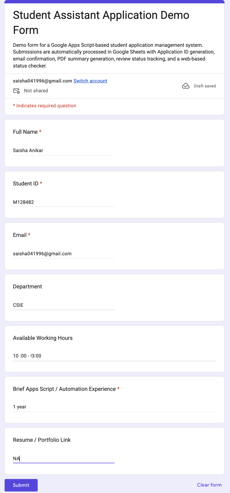
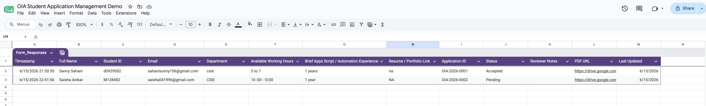
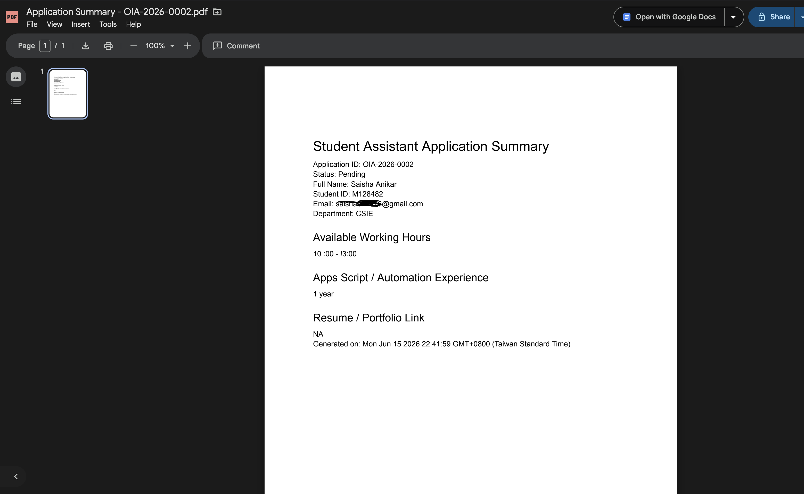
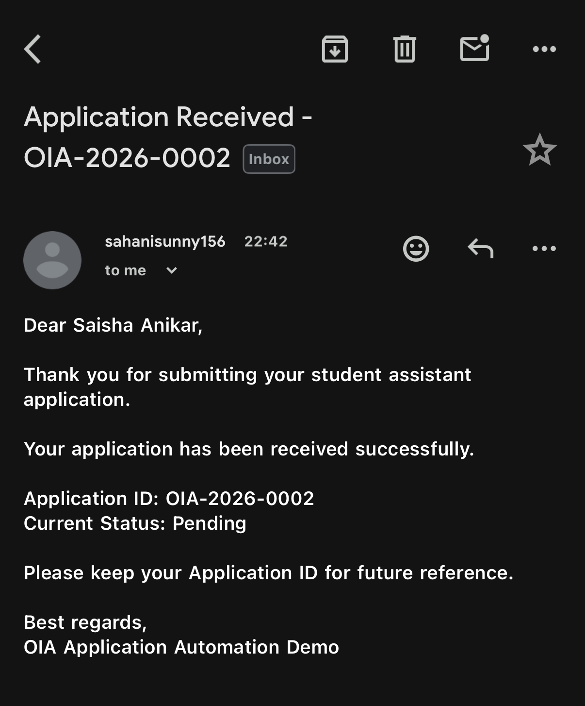
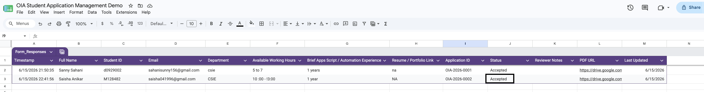
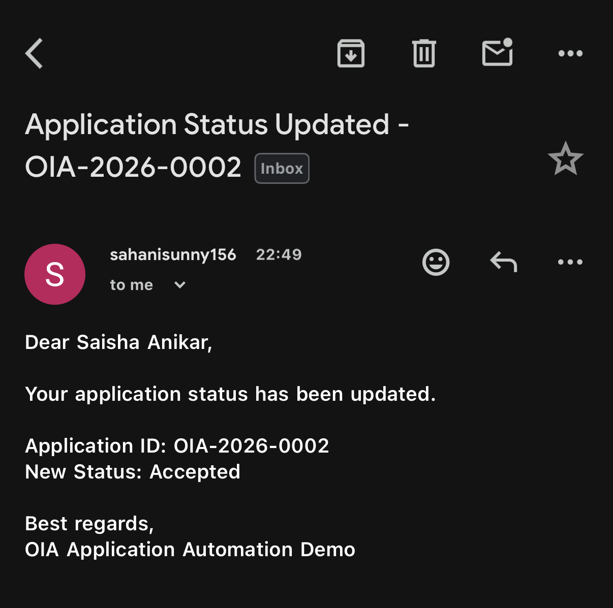
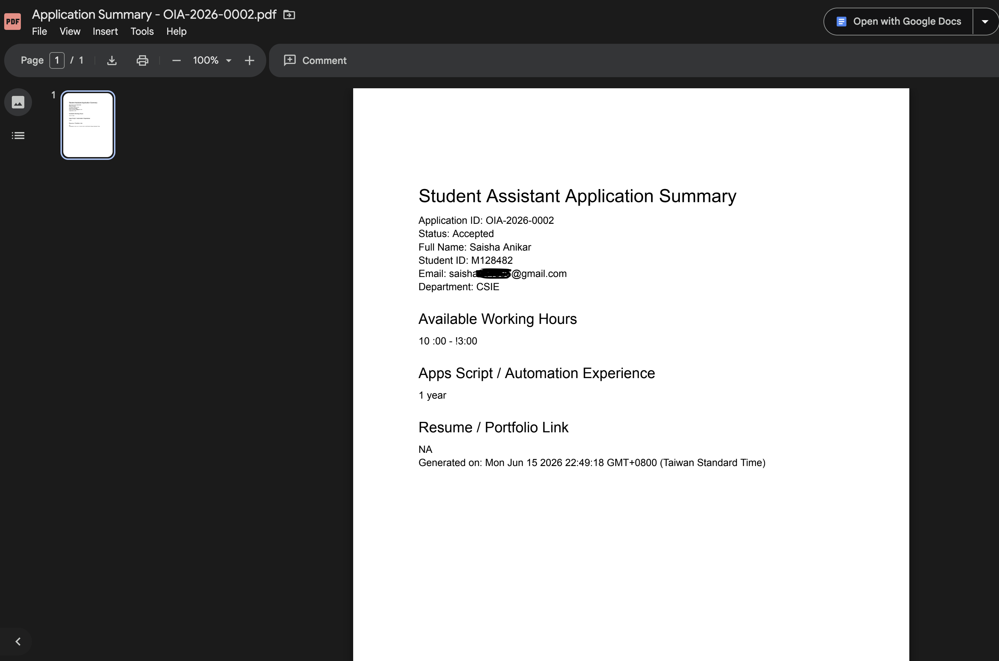
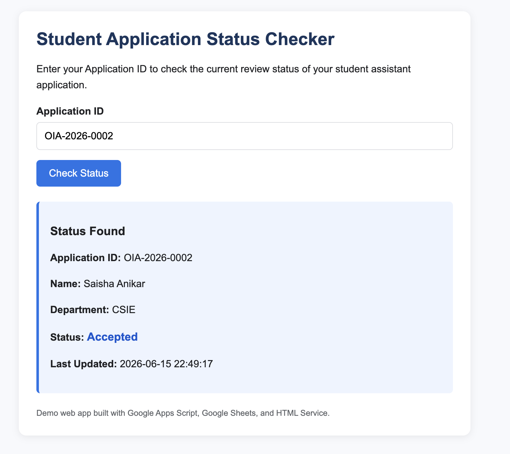
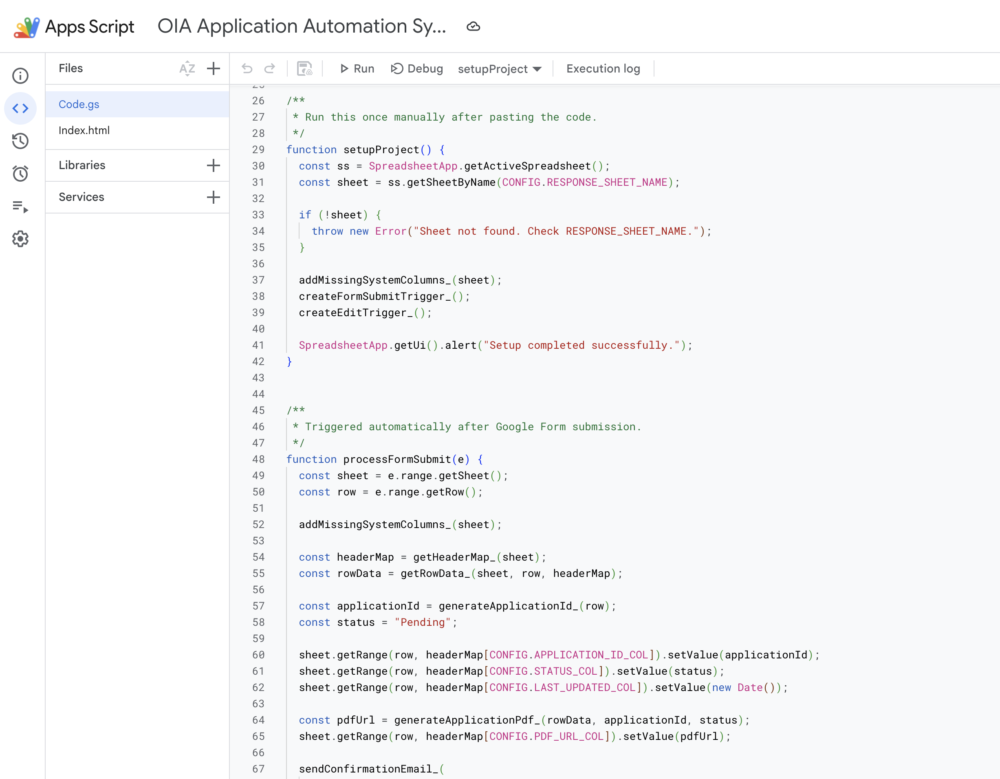

# OIA Student Application Automation System

A Google Apps Script-based demo project for managing student assistant applications using Google Forms, Google Sheets, Gmail, Google Drive, PDF generation, and a web-based status checker.

This project was built as a practical automation demo for an Office of International Affairs-style student assistant workflow.

---

## Project Objective

The goal of this project is to demonstrate practical skills in Google Apps Script automation, including:

* Reading and writing data in Google Sheets
* Processing Google Form submissions automatically
* Generating unique Application IDs
* Sending confirmation emails
* Creating PDF application summaries
* Updating review status through Google Sheets
* Sending automatic status update emails
* Providing a simple web-based application status checker

---

## Workflow Overview

1. Applicant submits a Google Form.
2. The response is stored in Google Sheets.
3. Apps Script automatically generates an Application ID.
4. The application status is set to `Pending`.
5. A confirmation email is sent to the applicant.
6. A PDF summary of the application is generated and saved to Google Drive.
7. A reviewer updates the status in Google Sheets.
8. Apps Script updates the timestamp, regenerates the PDF, and sends a status update email.
9. Applicant checks the latest status using the web app.

---

## Features

### Form Submission Automation

When a form response is submitted, the system automatically:

* Reads the submitted data
* Generates a unique Application ID
* Writes status information into Google Sheets
* Records the last updated timestamp
* Generates a PDF summary
* Sends a confirmation email

### Review Status Workflow

When a reviewer changes the application status in Google Sheets, the system automatically:

* Updates the `Last Updated` field
* Regenerates the PDF summary with the latest status
* Sends a status update email to the applicant

Example statuses:

* Pending
* Under Review
* Accepted
* Rejected

### Web-Based Status Checker

A simple front-end web page allows applicants to enter their Application ID and check:

* Application ID
* Applicant name
* Department
* Current status
* Last updated time

---

## Tech Stack

* Google Apps Script
* Google Forms
* Google Sheets
* Gmail Service
* Google Drive Service
* DocumentApp
* HTML Service
* JavaScript
* HTML/CSS

---

## Project Files

| File                      | Description                                           |
| ------------------------- | ----------------------------------------------------- |
| `Code.gs`                 | Main Google Apps Script backend code                  |
| `Index.html`              | Front-end web app for checking application status     |  
| `screenshots/`            | Demo screenshots showing the working workflow         |
| `docs/project_summary.md` | Short project explanation for non-technical reviewers |

## screenshots/

### 1. Google Form

### 2. Form Submission Saved in Google Sheets

### 3. Application ID and PDF Generated

### 4. Confirmation Email

### 5. Reviewer Status Update in Google Sheets

### 6. Status Update Email

### 7. Updated PDF Summary

### 8. Web App Status Checker

### 9. Apps Script Code

## Skills Demonstrated

This project demonstrates practical experience with:

* Google Apps Script development
* Google Workspace automation
* Spreadsheet-based workflow design
* Trigger-based automation
* Form submission processing
* Email automation
* PDF/document generation
* Review workflow design
* Front-end and back-end integration using Apps Script HTML Service
* Basic user-facing documentation

---

## Demo Note

This is a demo project using sample data. For real-world deployment, additional privacy, access control, error handling, and data protection mechanisms would be required.
